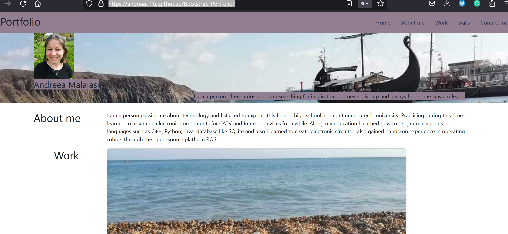

# Bootstrap-Portfolio

## Description

Provide a short description explaining the what, why, and how of your project. Use the following questions as a guide:

- My motivation was to learn how to create a portfolio which enhances chances to get a job in the field;
- Building oit I learned bootstrap libraries and frameworks of using it;
- It solves the problem of using time more efficiently programming by using bootstrap libraries;
- I learned how to combine resources for a good result.

## Installation
https://andreea-lita.github.io/Bootstrap-Portfolio/

## Usage

Some illustrative screenshot of the project,more specific the first part and code of a container and grid element, and also section jumbotron hero in CSS:
   

## Credits

https://getbootstrap.com/docs/5.3/layout/grid/
https://getbootstrap.com/docs/5.3/layout/breakpoints/
https://getbootstrap.com/docs/5.3/components/navbar/

## License

Mit License

## Tests

Functionally of the internal quick links from navbar and bootstrap cards!